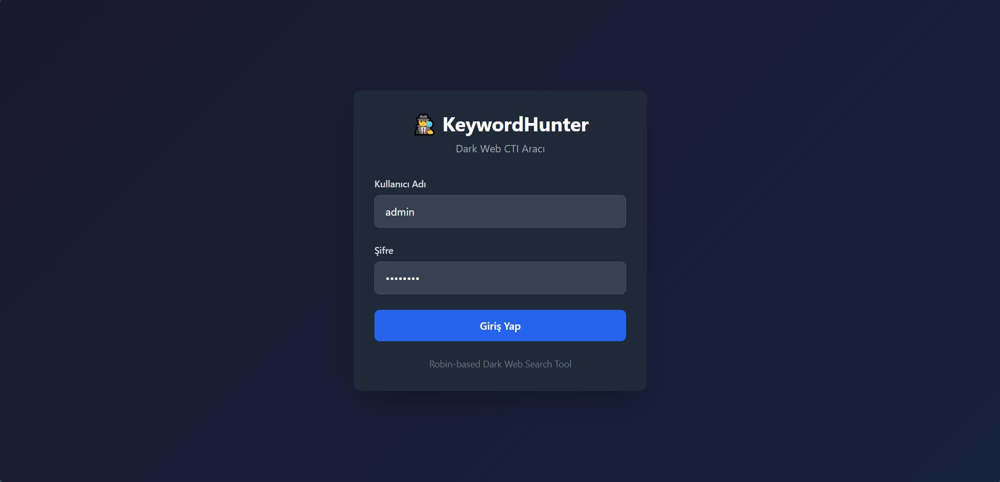

# KeywordHunter - Cyber Threat Intelligence Platform

KeywordHunter, Dark Web (Tor Ağı) ve çeşitli açık kaynaklı istihbarat kanallarında anahtar kelime tabanlı tarama yapan, elde edilen verileri ilişkilendiren ve analistler için görselleştiren gelişmiş bir CTI (Cyber Threat Intelligence) aracıdır.

Bu proje, güvenlik analistlerinin tehditleri erken tespit etmesi, veri sızıntılarını izlemesi ve aktörler arasındaki ilişkileri haritalandırması için geliştirilmiştir. Yüksek performanslı Go mimarisi üzerine inşa edilmiştir.

## Kurulum ve Çalıştırma

Projeyi çalıştırmak için iki yöntem bulunmaktadır. Üretim ortamları ve hızlı testler için Docker önerilir.

### Yöntem 1: Docker ile Kurulum (Önerilen)

**Gereksinimler:** Docker 20.10+ ve Docker Compose v2+ (veya `docker-compose` v1.29+)

#### Hızlı Başlangıç (3 adım)

```bash
git clone https://github.com/mehmetyasinuzun/Keyword-Hunter.git
cd Keyword-Hunter
mkdir -p data
cp .env.example data/.env
docker compose up -d --build
```

Windows PowerShell için:

```powershell
git clone https://github.com/mehmetyasinuzun/Keyword-Hunter.git
cd Keyword-Hunter
New-Item -ItemType Directory -Path data -Force | Out-Null
Copy-Item .env.example data/.env -Force
docker compose up -d --build
```

> Eski Docker sürümlerinde: `docker-compose up -d --build`

#### Erişim

| Bileşen | Adres | Notlar |
|---------|-------|--------|
| Web Arayüzü | `http://localhost:8080` | |
| Giriş bilgileri | `data/.env` içindeki `ADMIN_USER` / `ADMIN_PASS` | Örnek varsayılan: `admin` / `admin123` |

#### Çalışan Servisler

```
keywordhunter-tor   → Tor proxy (dahili: tor:9050)
keywordhunter-app   → Go web sunucusu (dışa: 8080)
```

Uygulama başladıktan sonra Tor bağlantısı kurulana kadar arama özelliği **~10-30 saniye** bekleyebilir.

#### Ortam Değişkenleri Referansı

| Değişken | Varsayılan | Açıklama |
|----------|------------|----------|
| `ADMIN_USER` | — | **Zorunlu.** Giriş kullanıcı adı |
| `ADMIN_PASS` | — | **Zorunlu.** Güçlü bir şifre seçin |
| `TOR_PROXY` | `tor:9050` | Docker içi Tor adresi (değiştirmeyin) |
| `DB_PATH` | `/data/keywordhunter.db` | SQLite veritabanı yolu |
| `WEB_ADDR` | `:8080` | Sunucu dinleme adresi |
| `LOG_DIR` | `/data/logs` | Log dosyaları dizini |
| `LOG_LEVEL` | `info` | Log seviyesi: `debug` / `info` / `warn` / `error` |
| `SESSION_TTL_HOURS` | `24` | Oturum geçerlilik süresi (1–720) |
| `RATE_LIMIT_RPS` | `12` | Saniyede maksimum istek (1–200) |
| `RATE_LIMIT_BURST` | `30` | Ani yük toleransı (1–500) |
| `WEB_SECURE_COOKIES` | `false` | HTTPS kullanıyorsanız `true` yapın |

#### Faydalı Komutlar

```bash
# Logları canlı izle
docker compose logs -f

# Sadece uygulama loglarını izle
docker compose logs -f app

# Konteyner durumunu gör
docker compose ps

# Durdur (veriler korunur)
docker compose down

# Tamamen sıfırla (VERİTABANI SİLİNİR)
docker compose down -v
rm -rf ./data

# Güncelleme sonrası yeniden derle
docker compose up -d --build --force-recreate
```

#### Kalıcı Veriler

```
./data/
├── keywordhunter.db   ← SQLite veritabanı (tüm bulgular)
├── .env               ← /settings ekranından yapılan değişiklikler buraya yazılır
└── logs/              ← Uygulama logları
```

> `/settings` ekranından yapılan tüm runtime ayar değişiklikleri `./data/.env` dosyasına yazılır ve konteyner yeniden başlatılsa bile korunur.

Docker çalışırken kaynak env dosyası `./data/.env` dosyasıdır; root `.env` dosyası Docker için kullanılmaz.

#### Sorun Giderme

**Konteyner başlamıyor:**
```bash
docker compose logs app
# "ADMIN_USER ve ADMIN_PASS zorunludur" hatası → .env dosyasını kontrol edin
```

**Tor bağlantısı kurulamıyor:**
```bash
docker compose logs tor
# tor servisi running değilse: docker compose restart tor
```

**Port 8080 kullanımda:**
```bash
# .env içinde WEB_ADDR=:9090 yapın, ardından docker-compose.yml'de
# ports: "9090:9090" olarak güncelleyin
```

**Sağlık kontrolü:**
```bash
curl -s -o /dev/null -w "%{http_code}" http://localhost:8080/login
# 200 dönüyorsa sistem hazır
```



### Yöntem 2: Manuel Kurulum (Windows/Linux)

Geliştirme yapmak veya Docker kullanmadan çalıştırmak isterseniz:

1. Gereksinimler:
   - Go 1.24 veya üzeri
   - Tor Browser (Arka planda çalışmalı ve 9150 portunu dinlemeli)
   - CGO_ENABLED=0 ile derleme yapıldığından GCC gerekmez

2. Derleme ve Başlatma:
   Windows kullanıcıları için hazır script bulunmaktadır. Bu script eski derlemeleri temizler ve projeyi yeniden başlatır:
   ```bash
   copy .env.example .env
   # .env dosyasında ADMIN_USER ve ADMIN_PASS değerlerini düzenleyin
   build_and_run.bat
   ```

## Modüller ve Özellikler

Uygulama, istihbarat döngüsünü yönetmek için 5 ana modülden oluşur.

### 1. Dashboard (Genel Bakış)
Sistemin komuta merkezidir. Anlık olarak yürütülen operasyonların özetini sunar. Sol taraftaki istatistik paneli veritabanındaki toplam veri hacmini gösterirken, sağ taraftaki grafikler tehditlerin kritiklik seviyelerine (Level 1-5) göre dağılımını analiz eder.


### 2. Arama Motoru (Hunter Search)
Hedef odaklı istihbarat toplama modülüdür. Analist, Regex (Düzenli İfade) desteği sayesinde karmaşık sorgular oluşturabilir.
- **Çoklu Kaynak:** Aynı anda 17'den fazla arama motorunu ve .onion dizinini tarar.
- **Filtreleme:** Sadece belirli tarih aralığındaki veya belirli formatlardaki (örn: kredi kartı bin numaraları) verileri getirebilir.


### 3. Bulgular (Results)
Toplanan ham verilerin işlendiği ve listelendiği alandır. Her sonuç, bulunduğu kaynağa, tespit edilme zamanına ve içeriğin özetine göre listelenir. Analistler buradan ilgisiz verileri eleyebilir veya kritik verileri "Vaka" (Case) olarak işaretleyebilir.


### 4. İlişki Analizi (Graph Intelligence)
Metin tabanlı verilerin görselleştirilmiş halidir. Özellikle organize suç gruplarını veya birbiriyle bağlantılı veri sızıntılarını tespit etmek için kullanılır.

#### Görselleştirme Modları
Analiz türüne göre 3 farklı görünüm modu sunar:

**1. Radial View (Odaklı Analiz):** Seçilen düğümü merkeze alarak ilişkileri dairesel dağıtır.


**2. Tree View (Hiyerarşik Analiz):** Veriler arasındaki ata-çocuk ilişkisini ağaç yapısında gösterir.


**3. Network View (Serbest Kümeleme):** İlişkisi güçlü olan veriler birbirine çekilir (Force-Directed).


#### Aksiyon Menüsü
Analist, herhangi bir düğüme sağ tıklayarak detaylı aksiyon menüsüne erişebilir (Derinleştirme, Kopyalama, Gizleme vb.).


### 5. Analitik Merkezi (Analytics)
Operasyonel verilerin stratejik bilgiye dönüştüğü yerdir.
- **Zaman Analizi:** Saldırıların veya sızıntıların hangi saatlerde/günlerde yoğunlaştığını gösteren zaman çizelgesi.
- **Kaynak Dağılımı:** Hangi marketlerin veya forumların daha aktif olduğunu gösteren pasta grafikler.


### 6. Ayarlar Merkezi (Runtime Config)
Platform ayarlarının `.env` üzerinden yönetildiği kontrol ekranıdır (`/settings`).
- **Yönetilebilir Konfigürasyon:** Admin bilgileri, rate-limit, session TTL, Tor/DB/Web adresleri.
- **Canlı Etki:** Rate-limit ayarları kaydedildiği anda uygulanır.
- **Güvenlik:** API POST işlemlerinde CSRF koruması ve IP bazlı rate-limit aktif çalışır.

### 7. Bildirim Merkezi (`/scheduled`)
Yeni bulgular için webhook bildirimleri yapılandırma ekranıdır.
- **Webhook Desteği:** Slack, Discord, Teams veya herhangi bir HTTP webhook ile entegrasyon.
- **Eşik Ayarı:** Minimum kritiklik seviyesi belirlenerek gereksiz bildirimler engellenir.
- **Canlı Feed:** Son N saatteki yeni bulgular bu ekranda anlık takip edilebilir.

## Teknik Mimari

- **Backend:** Go (Golang) - Gin Framework
- **Veritabanı:** SQLite (Gorm ORM ile)
- **Frontend:** HTML5, CSS3, Vanilla JavaScript
- **Veri Toplama:** Colly (Scraping Framework) ve Tor Proxy
- **Görselleştirme:** Chart.js ve D3.js

## Yasal Uyarı

Bu yazılım, siber güvenlik uzmanları ve araştırmacılar için geliştirlmiştir. Yetkisiz sistemlere erişim sağlamak veya yasadışı faaliyetlerde bulunmak amacıyla kullanılamaz. Kullanıcı, aracı yasal sınırlar içerisinde kullanmakla yükümlüdür.

---
**Sürüm:** v0.5
**Geliştirici:** Mehmet Yasin Uzun
