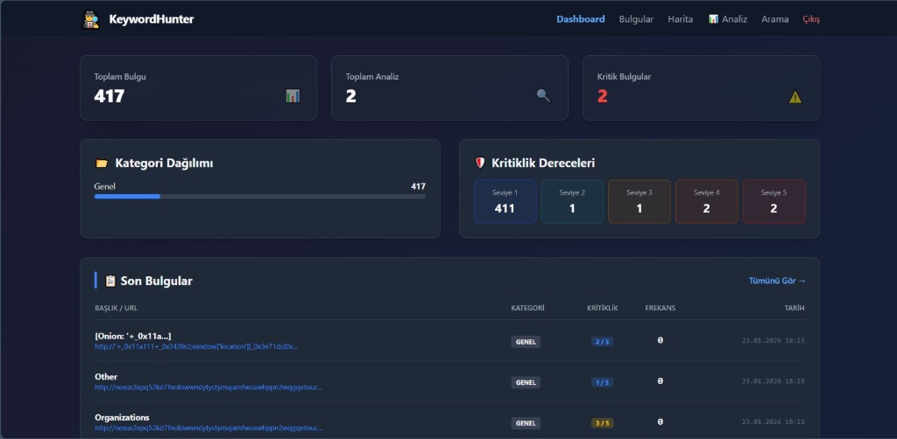
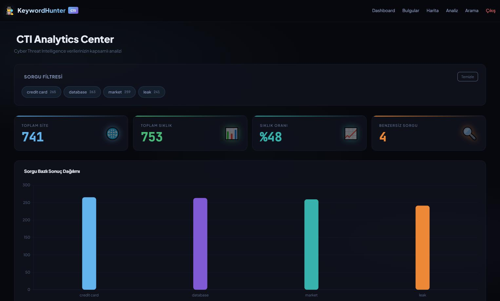
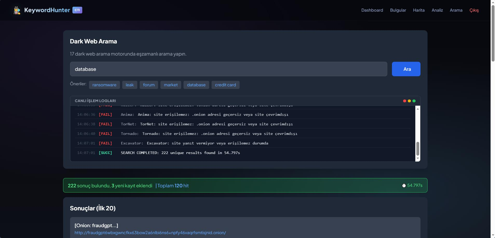
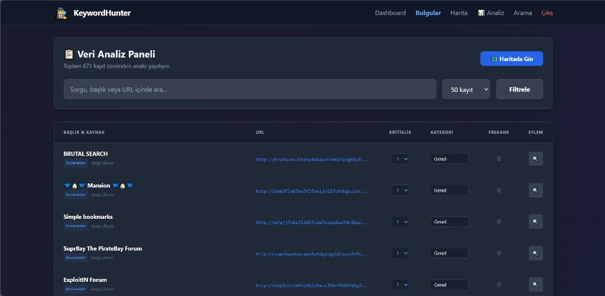
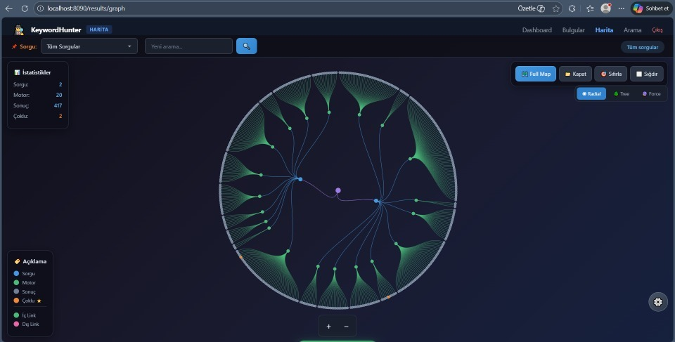
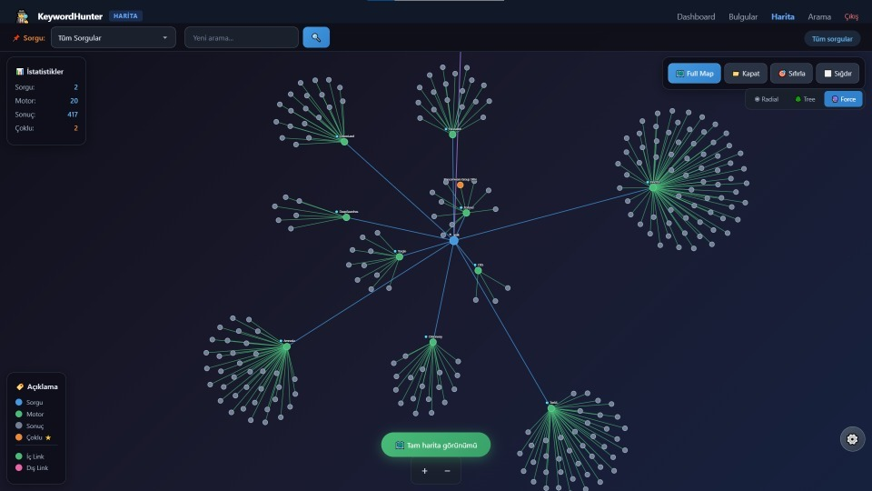
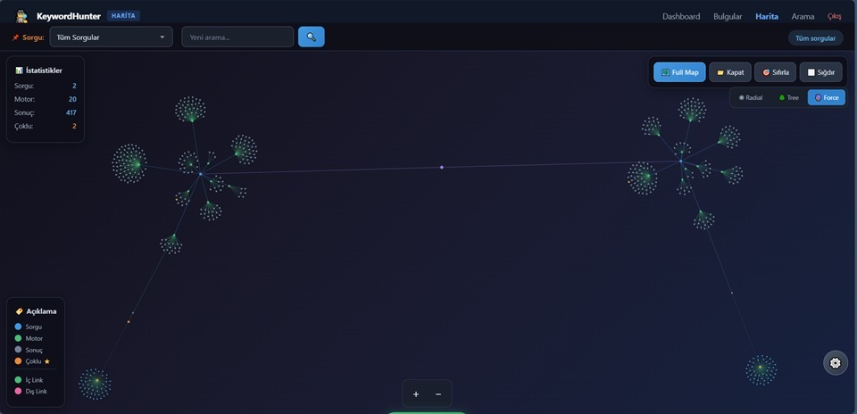
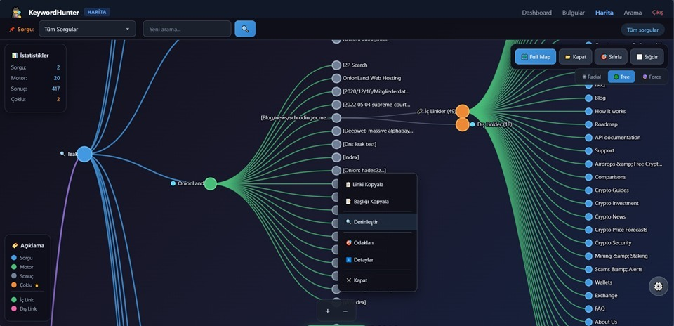

# KeywordHunter - Dark Web CTI Analyst Tool


**KeywordHunter**, Dark Web verilerini (17+ arama motoru ve .onion siteleri) tarayan, analiz eden ve görselleştiren gelişmiş bir Siber Tehdit İstihbaratı (CTI) aracıdır. Analistlerin veriler arasındaki ilişkileri görmesini, kaynak dağılımlarını incelemesini ve kritiklik seviyelerine göre tehditleri önceliklendirmesini sağlar.

---

## Kurulum ve Başlatma (Local)

Hızlıca başlamak için bu adımları izleyin:

1.  **Gereksinimler:**
    *   Bilgisayarınızda **Tor Browser** kurulu ve çalışıyor olmalıdır (Proxy port: `9150` varsayılır).
    *   **Go** yüklü olmalıdır.

2.  **Projeyi İndirin:**
    ```bash
    git clone https://github.com/mehmetyasinuzun/Keyword-Hunter.git
    cd Keyword-Hunter
    ```

3.  **Başlatma:**
    Uygulamayı başlatmak için bat dosyasını çalıştırın. Bu script port çakışmalarını otomatik çözer.
    ```bash
    baslat.bat
    ```

4.  **Erişim:**
    Tarayıcınızdan `http://localhost:8080` adresine gidin.
    *   **Kullanıcı Adı:** `admin`
    *   **Şifre:** `admin123`

---

## Arayüz ve Özellikler

Uygulama, siber istihbarat analistlerinin iş akışını kolaylaştırmak için modüler sayfalardan oluşur.

### 1. Dashboard (Kontrol Paneli)
Merkezi yönetim ekranıdır. Sistemdeki toplam veri özetini, en son yapılan aramaları ve tespit edilen bulguların kritiklik dağılımını gösterir.
*   "Toplam Analiz" kartının üzerine gelerek son 5 arama geçmişini anlık görebilirsiniz.
*   Kritiklik seviyelerinin (Level 1-5) üzerine gelerek detaylı açıklamalarını okuyabilirsiniz.



### 2. Analiz Hub (Analytics)
Verilerin derinlemesine istatistiksel analizini sunar.
*   **Zaman Çizelgesi (Timeline):** Tehditlerin zaman içindeki değişimini (Saatlik/Günlük/Haftalık) izleyin.
*   **Kaynak Dağılımı:** Hangi arama motorundan ne kadar veri geldiğini pasta grafikte görün.
*   **Sorgu Performansı:** En çok sonuç getiren anahtar kelimeleri inceleyin.



### 3. Arama (Search)
Dark Web üzerinde anahtar kelime veya domain bazlı arama yapmanızı sağlar.
*   **.Onion Desteği:** Tor ağı üzerinden güvenli tarama.
*   **Gelişmiş Regex:** Gereksiz sonuçları filtreleyen akıllı regex motoru.



### 4. Bulgular (Results)
Arama sonuçlarının listelendiği, detaylarının görüntülendiği sayfadır.
*   Her sonucun başlığı, URL'i ve özeti listelenir.
*   Analistler buradan manuel olarak kritiklik seviyesi atayabilir veya düzenleyebilir.



### 5. İlişki Ağı (Graph)
Veriler arasındaki bağlantıları görselleştiren interaktif ağ haritasıdır. Düğümler arası ilişkileri 3 farklı modda (Radial, Tree, Force) inceleyebilirsiniz.

#### Radial View (Dairesel Görünüm)
Merkezi odaklı analiz için idealdir.


#### Tree View (Ağaç Görünümü)
Hiyerarşik yapıları ve alt kırılımları görmek için kullanılır.


#### Network/Force View (Ağ Görünümü)
Dağınık ilişkileri ve kümeleri serbest düzende gösterir.


#### Context Menu & Details
Düğümlere sağ tıklayarak detaylı aksiyon menüsüne (Derinleştir, Linki Kopyala vb.) erişebilirsiniz.


---

## Kritiklik Seviyeleri (Criticality Levels)

Sistem, tespit edilen içerikleri otomatik veya manuel olarak derecelendirir:

*   **Level 5 (Kritik):** Ransomware duyuruları, Veri sızıntıları, Acil tehditler.
*   **Level 4 (Yüksek):** Database satışları, Zero-day exploit tartışmaları.
*   **Level 3 (Orta):** Hack forum tartışmaları, illegal marketplace aktiviteleri.
*   **Level 2 (Düşük):** Genel dark web sohbetleri, şüpheli aktiviteler.
*   **Level 1 (Bilgi):** Genel bilgiler, doğrulanmamış içerikler.

---

## Teknoloji Yığını

*   **Backend:** Golang (Performans odaklı mimari)
*   **Veritabanı:** SQLite (Kolay taşınabilirlik)
*   **Frontend:** HTML5, TailwindCSS, Chart.js (Modern ve responsive tasarım)
*   **Ağ:** Tor Network (Anonim veri toplama)

---

## Yasal Uyarı

Bu yazılım **Siber Güvenlik Uzmanları** ve **CTI Analistleri** için araştırma ve eğitim amaçlı geliştirilmiştir. Yasadışı faaliyetlerde kullanılması kesinlikle yasaktır ve tüm sorumluluk kullanıcıya aittir.

---

**Geliştirici:** Mehmet Yasin Uzun
**Sürüm:** v0.3
